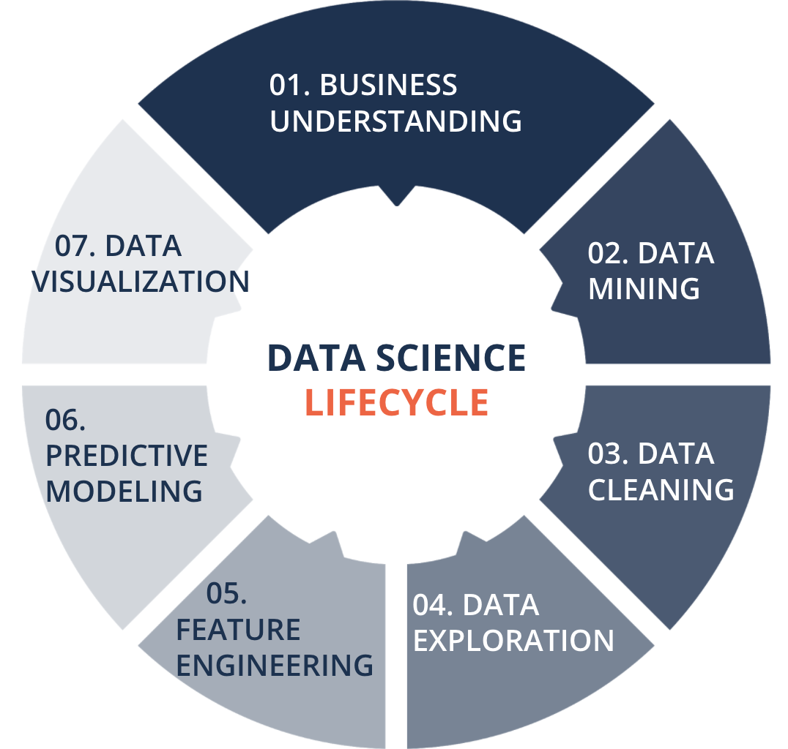

# EDA Example: Project House Price

In this repository I will go through all the important steps of the data science life cycle using the King County Housing Dataset as example for an Exploratory Data Analysis (EDA). The goal is to implement the essential steps to find insights in the data and model this dataset with a multivariate linear regression to predict sale price of houses.

I will apply the following methods: *Feature Engineering, train-test-split, train different models, hyper-parameter optimisation using grid-search and cross-validation, evaluation of model goodness.*

As a little reminder, here is the Data Science Life Cycle again. 
<center></center>

## Structure
To prevent a long notebook this repository consists of three jupyter notebooks:
1. [Data preparation and cleaning](01_data_preparation_cleaning.ipynb)
2. [Data exploration](02_data_exploration.ipynb)
3. [Sale price prediction](03_sale_price_prediction.ipynb)

## Environment 

In the added [requirements file](requirements.txt) contains all libraries and dependencies need. To set up a new virtual environment and to load the requirements you can use the following commands:

```sh 
pyenv local 3.8.5
python -m venv .venv
source .venv/bin/activate
pip install --upgrade pip
pip install -r requirements.txt
```

